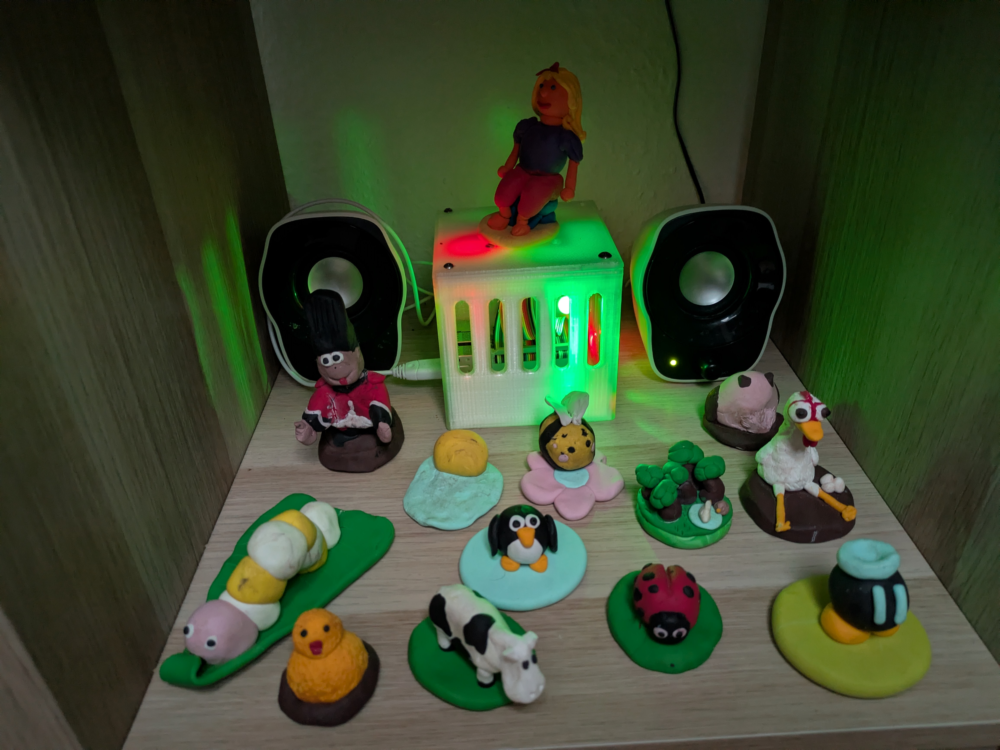
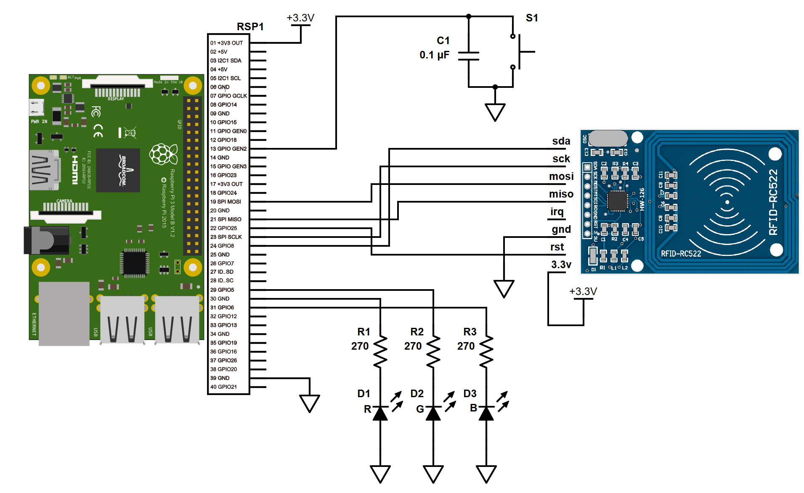

# The Jukebox Project: A Yocto-Based Audio Appliance

**A production-grade, RFID-controlled music player for children, built on Embedded Linux.**



*Figure 1: Jukebox*

## 📖 The Story
This project started as a summer vacation experiment to build a music player for my children. Originally, it was a "vibe-coded" prototype running on a standard Raspberry Pi OS, held together by manual scripts and SD card backups.

However, the "customers" (my kids) started requesting feature updates and bug fixes. I realized that manually patching a live device was not sustainable. To solve this and to sharpen my professional toolkit—I migrated the entire stack to **The Yocto Project**.

This repository now represents a fully reproducible, embedded Linux appliance. It demonstrates how to take a Python prototype and harden it into a custom OS image with automated builds, systemd service management, and proper dependency handling.

## 🎮 How It Works
The user interaction is designed to be screen-free and intuitive for children:

1.  **Place a Tag:** The system reads the RFID UID and looks it up in `mappings.cfg`. If recognized, it plays the specific folder associated with that toy/card.
2.  **Remove the Tag:** Playback stops immediately.
3.  **Smart Resume:** If the *same* tag is placed again, the system remembers the position and plays the **next** song in the folder (cycling through the album).
4.  **Default Mode:** If an unknown tag is used (or configured as such), the system plays from a "Random Mix" folder.

## 🏗️ Architecture
*   **Hardware:** Raspberry Pi 3B + MFRC522 RFID Reader (SPI) + GPIO Controls.
*   **OS:** Custom Yocto Image (Scarthgap Release).
*   **Orchestration:** `kas` for build configuration and reproducibility.
*   **Application:** Python 3 + VLC (cvlc) + Systemd.

> 🔌 **Hardware Details:** For pinouts, wiring diagrams, and the full software stack, please see [ARCHITECTURE.md](./ARCHITECTURE.md).

## 🚀 Getting Started

This project uses **kas** to orchestrate the BitBake build system. This ensures that you get the exact same layers and commits that I used.

### 1. Set up the Python Environment
You need a host Python environment to run `kas`.

```bash
# 1. Install the venv module (Ubuntu/Debian)
sudo apt-get install python3-venv

# 2. Create a new virtual environment
python3 -m venv .venv

# 3. Activate the environment
source .venv/bin/activate
# Note: When active, (.venv) appears at the start of your command prompt.

# 4. Install kas
pip install kas
```

### 2. Build the Image
Once the environment is active, you can fetch layers and build the image in one command:

```bash
kas build kas-project.yml
```

*Note: The first build will take significant time as it compiles the toolchain and the OS from source.*

### 3. Flash & Deploy
The output image will be located in:
`build/tmp/deploy/images/raspberrypi3/jukebox-image-raspberrypi3.wic.bz2`

Flash this to an SD card using BalenaEtcher or `dd`.

**Post-Boot Setup:**
Since this is a read-only capable system, music files are not baked into the image.
1.  Boot the Pi.
2.  Connect via SSH.
3.  Upload your MP3 folders to `/home/root/music`.
4.  Edit `/usr/bin/mappings.cfg` to link your RFID tags to those folders.

## 📂 Resources
*   **Schematics:**



*Figure 2: Jukebox Hardware Schematic*

*   **[3D Printed Case](./docs/case)**  


## 🔗 Additional Links
*   [The Yocto Project Documentation](https://docs.yoctoproject.org/)
*   [Kas Documentation](https://kas.readthedocs.io/)